# D-HIGHFILL, High fill (J = 0.42)

*The charge cross-section for this case, generated from the same engine the App runs (`data-pipeline/pipeline/science/gen_case_svgs.mjs`): the Davis departure fan (clipped inside the shell), the shoulder angle, and the regime + net power.*

**Category:** fill / charge regime · **Source of truth:** [`frontend/src/mill/cases.ts`](../../frontend/src/mill/cases.ts) (`D-HIGHFILL` = the base `K-BALL` mill at J 0.42) · **synthetic but physically realistic**

**Operating point:** the base 4.0 × 6.0 m ball mill (φc 0.75, 80 mm) at **J 42 %**.

The high-charge companion to `D-LOWFILL`. The Hogg-Fuerstenau charge power follows a term that rises with fill and then turns over, it is **maximal near J ≈ 0.47** (the root of `d/dJ [ J·(1 − 1.065 J) ] = 0`). At J 42 % the mill sits **near that power peak**, drawing more than the J 35 % reference, but pushing fill higher gains little more and risks **charge crowding** (the bed packs, the cataract is damped). This pair (`D-LOWFILL` ↔ `D-HIGHFILL`) makes the non-monotone power-vs-fill relationship legible.

**Validation anchor:** net power **near the maximum** of `J·(1 − 1.065 J)`; above J 45 % the engine raises the "charge crowding" validity flag.
