# K-SAG, SAG mill (large D, short L)

*The charge cross-section for this case, generated from the same engine the App runs (`data-pipeline/cclab/science/gen_case_svgs.mjs`): the Davis departure fan (clipped inside the shell), the shoulder angle, and the regime + net power.*

**Category:** mill type (the machine) · **Source of truth:** [`frontend/src/mill/cases.ts`](../../frontend/src/mill/cases.ts) (`K-SAG`) · **synthetic but physically realistic**

**Operating point:** D 10.0 × L 5.0 m · J 28 % · φc 0.78 · top ball 125 mm · sag mill · charge density 3.0 t/m³ · F80 100 000 → P80 2000 µm at 2000 t/h.

A semi-autogenous mill is a large-diameter "pancake" (D ≫ L) charged with a few large balls **plus the ore itself as media**, so its bulk charge density (3.0 t/m³) sits below a ball mill's (4.8), mostly rock, some steel. Run at φc ≈ 0.78 it **cataracts**: the big media are thrown high and impact-break coarse feed (F80 ≈ 100 mm) down to a transfer size. Because charge power scales steeply with diameter, the 10 m mill draws **≈ 6.11 MW**, by far the most of any case, and the reason SAG mills dominate a concentrator's power bill.

**Validation anchor:** net power scales as ≈ D^2.5 at fixed length (the engine's Hogg-Fuerstenau diameter dependence: ω ∝ D^-0.5, charge mass ∝ D^2, torque arm ∝ D), giving multi-MW on the 10 m mill, in the SAGMILLING / Doll published ballpark for this geometry.
