# S-CASCADE, Cascading (low speed)

*The charge cross-section for this case, generated from the same engine the App runs (`data-pipeline/cclab/science/gen_case_svgs.mjs`): the Davis departure fan (clipped inside the shell), the shoulder angle, and the regime + net power.*

**Category:** speed sweep (the regime transition) · **Source of truth:** [`frontend/src/mill/cases.ts`](../../frontend/src/mill/cases.ts) (`S-CASCADE` = the base `K-BALL` mill at φc 0.55) · **synthetic but physically realistic**

**Operating point:** the base 4.0 × 6.0 m ball mill (J 35 %, 80 mm) at **φc 0.55**.

The first of three snapshots of the **same** ball mill at rising speed, the regime transition the App is built to show. At φc 0.55 the shell turns too slowly to throw the charge: it **cascades**, the bulk rolling down the free surface as a continuous bed. Breakage here is **abrasion / attrition** (surface grinding), not impact, gentler, finer, lower-energy. Net power **≈ 872 kW**, below the cataracting draw because less mass is lifted high.

**Validation anchor:** regime = **cascading** with `fracCentrifuging = 0` (no shell pins to the wall). Compare directly with `S-CATARACT` (φc 0.78) and `S-CENTRIFUGE` (φc 1.02), same mill, only the speed changes.
