# S-CATARACT, Cataracting (the sweet spot)

*The charge cross-section for this case, generated from the same engine the App runs (`data-pipeline/pipeline/science/gen_case_svgs.mjs`): the Davis departure fan (clipped inside the shell), the shoulder angle, and the regime + net power.*

**Category:** speed sweep (the regime transition) · **Source of truth:** [`frontend/src/mill/cases.ts`](../../frontend/src/mill/cases.ts) (`S-CATARACT` = the base `K-BALL` mill at φc 0.78) · **synthetic but physically realistic**

**Operating point:** the base 4.0 × 6.0 m ball mill (J 35 %, 80 mm) at **φc 0.78**.

The same ball mill sped up into the **cataracting** regime, the operating sweet spot real mills are tuned to. The outer media are now carried past the shoulder and **thrown in parabolic free-flight arcs** (Davis trajectories) that land on the toe of the charge, delivering **impact breakage** of coarse particles. Net power **≈ 1.24 MW**, near the peak of the speed curve, more mass is lifted higher before release. Most production ball mills run φc ≈ 0.72–0.80 for exactly this balance of impact energy without over-speed.

**Validation anchor:** regime = **cataracting**; net power near the maximum of the power-vs-φc curve (just below where centrifuging begins to rob the draw of useful grinding).
